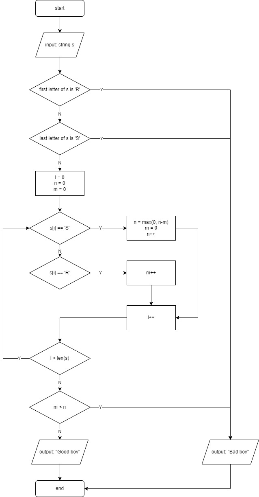

To start: `go run main.go`

The idea is to iterate through each letter, count the group of 'R' and substract from total 'S'. So, time complexity is O(n), n as a length of input.

The flow chart of this code is displayed below.

