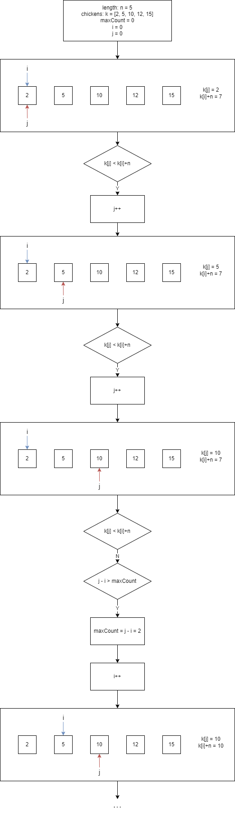

To start: `go run main.go`

I will call the length of the roof as n, and array of chickens' position as k.

The idea is to have 2 pointers, 'i' to iterate through k and 'j' starts from 0. In each i iterate, j will keep increasing if k[j] > k[i]+n. When k[j] <= k[i]+n, j-i is the amount of chickens that get saved. So I will find for max j-i from every i iterate. Hence, time complexity is O(m), m as len(k), because it runs 1 loop through k.

The example of how it works is displayed below.

